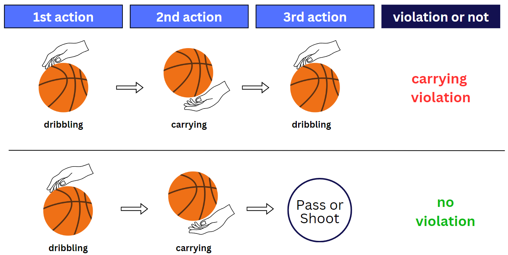
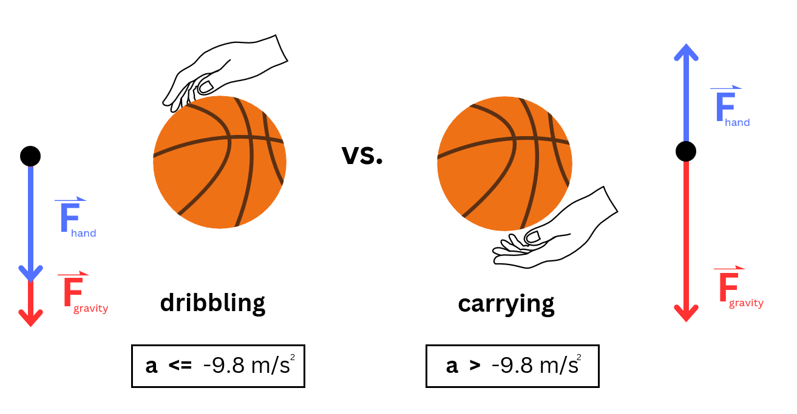

# How It Works

The AI I used is a computer vision object detection model called YOLOv8. This model can detect the spatial information of the basketball throughout the video, tracking its position frame by frame. Below is an example.

However, detecting where the basketball is is only the first step. To accurately identify a carrying violation, the algorithm needs to understand the **difference between carrying and dribbling actions**. 

According to the basketball rulebook, a carrying violation involves a specific sequence of actions that distinguishes it from regular dribbling.

## Theoretical Framework
This is where physics comes into play! By embedding a simple physics model into the algorithm alongside YOLOv8, the AI can differentiate between carrying and dribbling actions. The main idea is that:

> **By analyzing the acceleration of the basketball, we can determine whether the player is carrying or dribbling.**

In more technical terms, for a move to be classified as carrying, the basketball must exhibit an acceleration greater than the acceleration due to gravity (approximately -9.8 m/s²). 

If the basketball's acceleration is below this threshold, the action is considered regular dribbling.

Since **acceleration** is the second derivative of position with respect to time, calculating this variable becomes straightforward. 

The YOLOv8 model provides the **position vs. time series data** of the basketball, enabling us to derive the acceleration using various techniques, ranging from data preparation to data analysis.

[Continue to Part 3:Data Preparation](part3.md)
