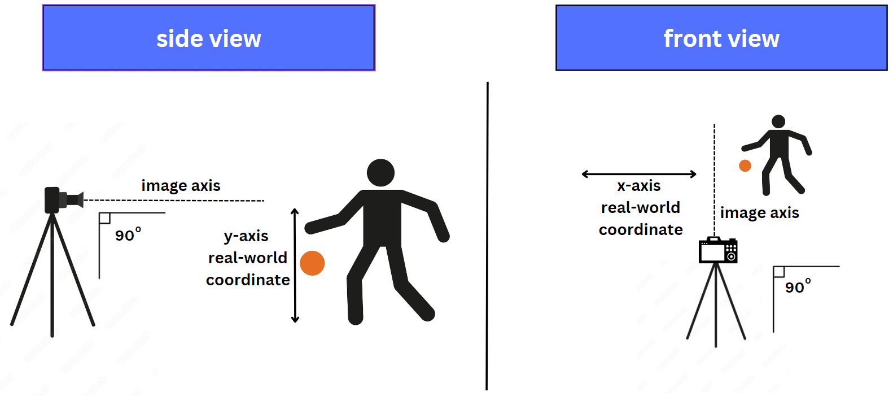
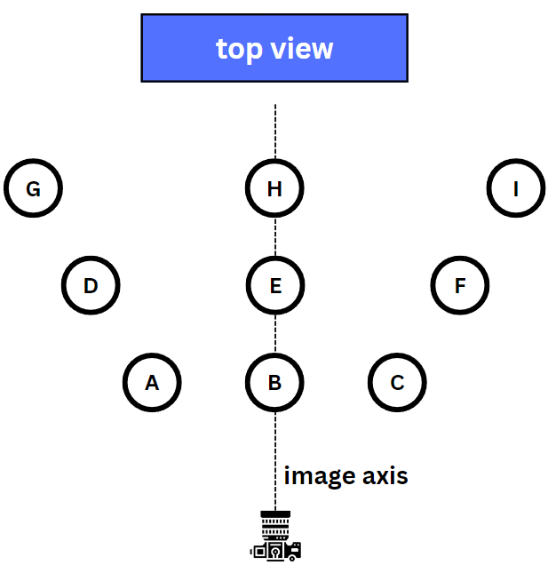
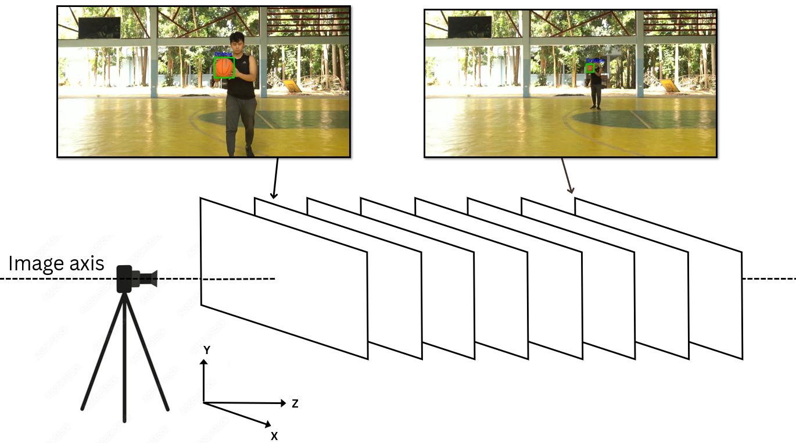
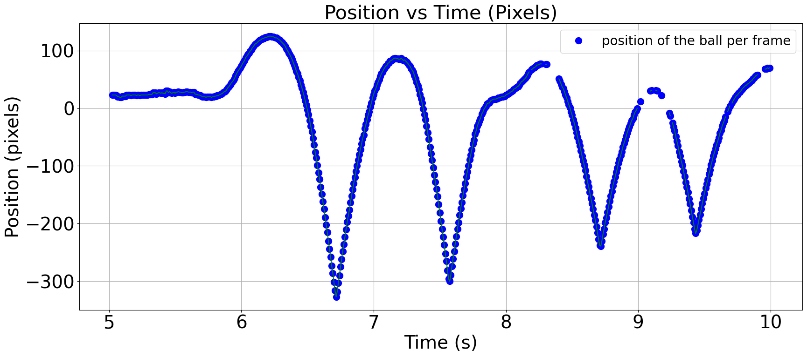
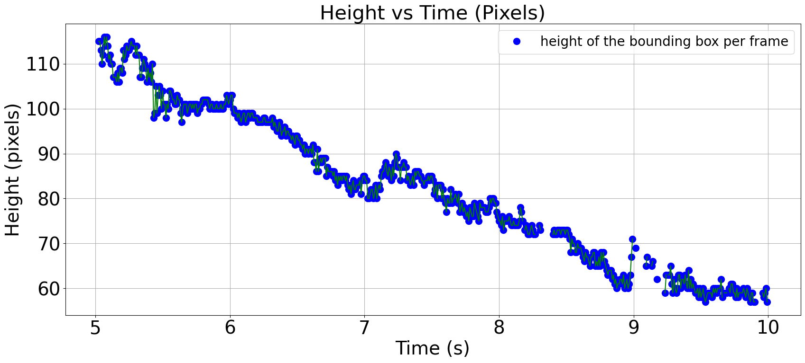
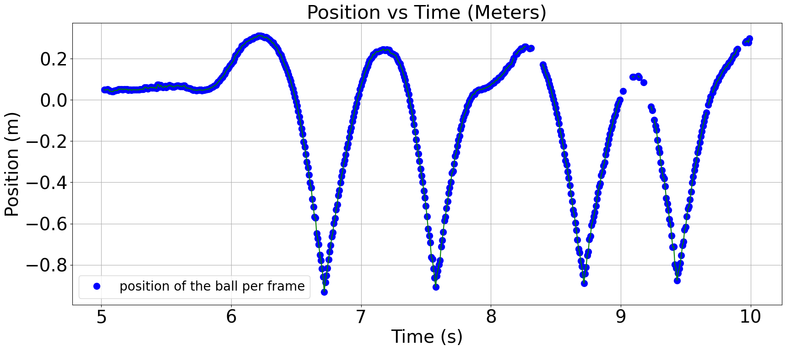

# Data Preparation

Since I am working with only a single camera (dual-camera setups would have been ideal, but budget constraints made that impossible), I had to find creative ways to ensure accurate data. Here’s how I approached it.

## 1) Measuring the Basketball's Diameter

I measured the basketball's diameter to serve as the basis for converting pixel units from the video into real-world length units (meters). The calculation was pretty straightforward, using $D = \frac{C}{\pi}$. 

## 2) Camera Alignment

Next, I positioned the camera so that it aligns **perpendicular to the direction of gravity**. This alignment ensures that the **y-axis** in the video directly corresponds to the **y-axis** in the real world, simplifying other calculations.

## 3) Testing Depth of Field Compatibility

To test how well the algorithm works at different depths and distances, I assigned areas where dribbling scenarios would occur. These areas were chosen to evaluate the algorithm’s **depth of field compatibility**, 

ensuring it can detect violations whether the basketball is close or far from the camera.

In the demo video, I dribbled from **Area H** to **Area B** and back repeatedly, as shown in the diagram below:

## 4) Perspective Correction

Because I am using a single-camera setup, I accounted for perspective. The green bounding box (shown in the diagram below) around the basketball in the video appears smaller as the ball moves farther from the camera and larger as it moves closer.

However, in the real world, the basketball’s diameter remains constant (unless, of course, it gets deflated or pierced!).

By applying the principles of perspective, I adjusted the calculations to ensure that the real-world diameter of the basketball was used for consistent and accurate data. The equation is as follows:

>$\textit{y position in meters}= \bigg(\frac{\textit{ball diameter in meters}}{\textit{bounding box height}}\bigg)\cdot \textit{y position in pixels}$

To visualize the importance of using principles in perspective, here is a line plot showcasing a portion of the basketball's position vs. time series data. 

Note that the units are still in pixels.

At this point in the video, I was dribbling **away** from the camera. If you’ve noticed, the height between the **bounces** and **peaks** keeps getting shorter and shorter. 

Now, unless I suddenly decided to start dribbling on an uphill slope (spoiler: I didn’t!), this is obviously not an accurate depiction of the basketball’s real-world position.

To reinforce this, we can also look at another plot of the same timeframe showcasing the relationship between the **height of the bounding box in pixels** and **time in seconds**.

So, using the equation mentioned above, we can plot the basketball's position vs. time series data, but this time, in **meters** instead of **pixels**.

Now that I’ve set up the steps to obtain potentially accurate data, there’s still a chance of encountering **dirty data**, which are inconsistent or noisy measurements caused by environmental factors, camera limitations, or even the AI model itself.

To address this, in the next part, I’ll discuss the statistical tools I used to clean and refine the **position vs. time series data**.

[Continue to Part 4: Data Cleaning](part4.md)
