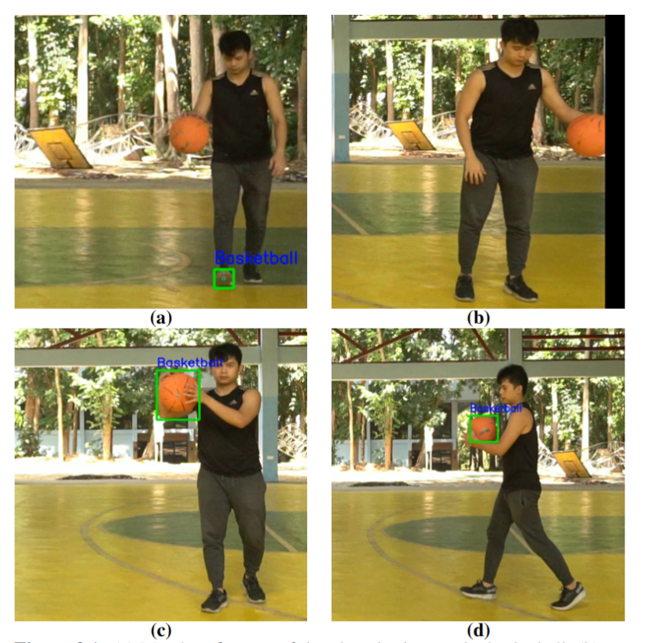
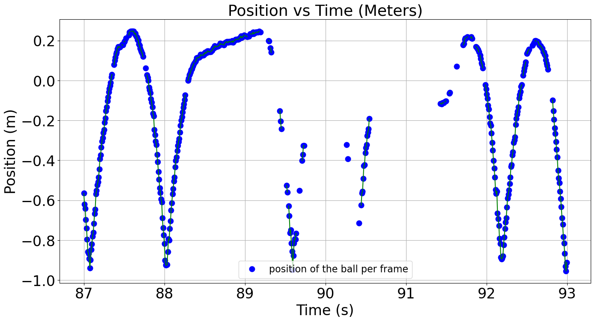
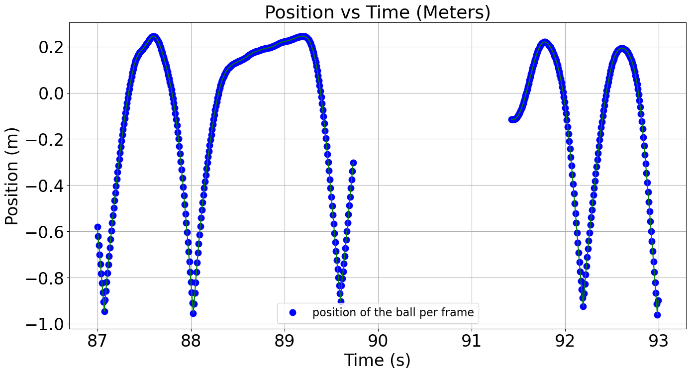
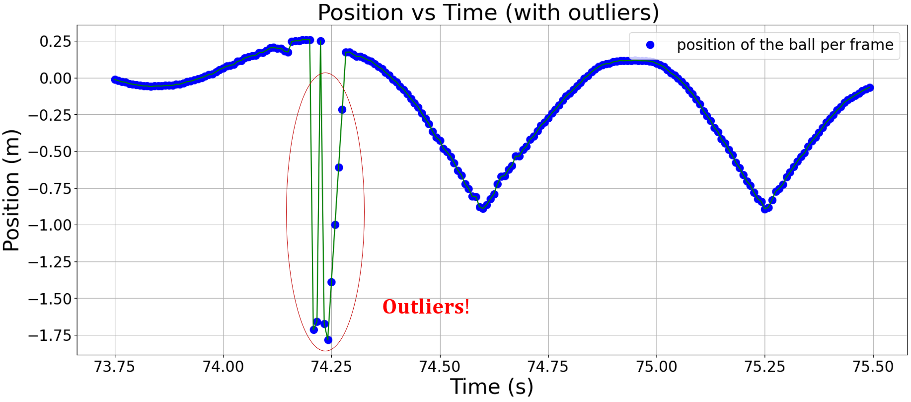
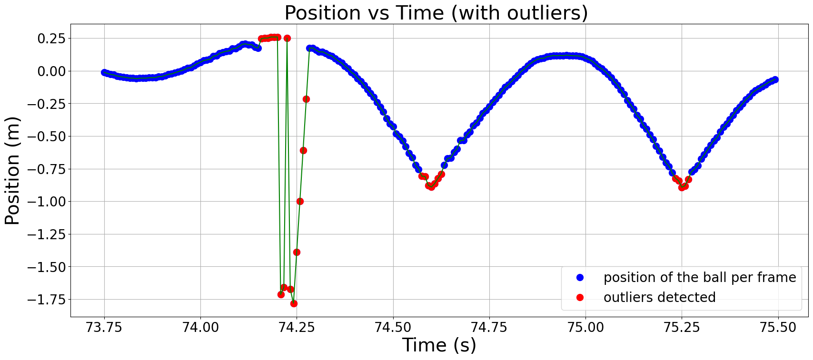
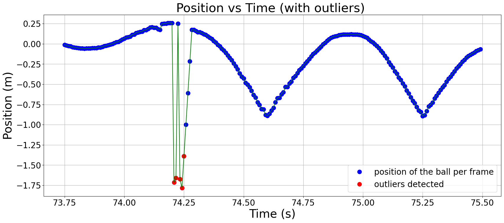
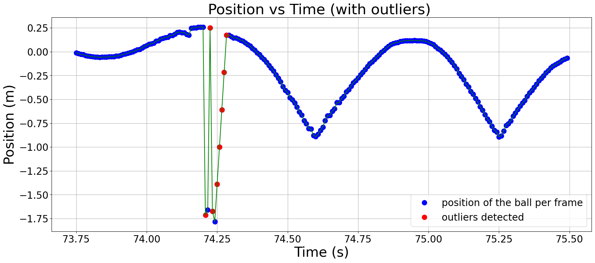

# Data Cleaning
Cleaning real-world data is like doing laundry: necessary, occasionally tedious, but absolutely worth it. YOLOv8 gave me a good starting point, but as with any AI model, it wasn’t perfect. 

## Limitations of YOLO

While it’s excellent at detecting objects, it occasionally got creative. Sometimes, it decided my shoe was the basketball (yep). 

Other times, the basketball disappeared entirely if it moved too close to the edge of the frame. 

And let’s not forget the bounding box height inconsistencies caused by occlusion (by my hand and sometimes, my other hand). 

## Whittaker-Eilers Smoothing Filter
To fix this, I brought in the **Whittaker-Eilers Smoothing Filter**. Now, I’m not going to bore you with all the math behind it (you’re welcome), but here’s why I used it: 

I stumbled upon this [resource](https://towardsdatascience.com/the-perfect-way-to-smooth-your-noisy-data-4f3fe6b44440) and thought, “Hey, this might work.” And it did! The filter not only smoothed out noisy data but also helped interpolate missing points when YOLO decided to take a coffee break.

It’s particularly useful because it allows you to adjust the smoothness to align with expected physical behaviors, like the constant acceleration due to gravity.

Still, smoothing alone wasn’t enough. The gaps in my data varied from small to large, so I implemented an **interpolation threshold**. This means that any missing sequence of data points longer than **24 frames** was ignored, as they are too sparse to interpolate reliably. 

Similarly, small clusters of detected data points (shorter than 24 frames) surrounded by large gaps (longer than 24 frames) were excluded because they didn’t provide enough context to, once again, interpolate reliably. 

By implementing the **Whittaker-Eilers Smoothing Filter**, along with the **interpolation threshold**, we get transformed data as shown in the diagrams below.

## MAD Filter For Outliers
Next, I had to deal with outliers, data points that deviate significantly from the expected trajectory of the basketball, often caused by detection errors. But finding the right approach took some trial and error:

1. Sliding Window MAD Filter: This filter almost worked but it overdid points near the **bounce data points**.

2. Global MAD Filter: A sliding window MAD filter, but accounts for the global minimum and maximum data points as thresholds. Thus, it excluded points within the extrema.

3. Modified MAD Filter: This time, instead of calculating directly the moving average of the data points, I modified it to calculate the moving average of the data points' **first derivative**. However, this also came with problems as it excluded some outliers that were clustered together.

4. Modified MAD Filter with Threshold: To improve upon the last technique, I added another **threshold technique** which assumes data points between two outliers that are separated not more than **10 frames** as outliers. This time, it finally worked! 
   

   
   
   
