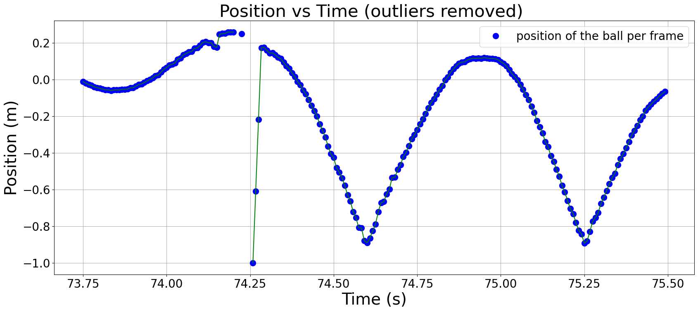

# Data Cleaning
Cleaning real-world data is like doing laundry: necessary, occasionally tedious, but absolutely worth it. YOLOv8 gave me a good starting point, but as with any AI model, it wasn’t perfect. 

## 1) Limitations of YOLO

While it’s excellent at detecting objects, it occasionally got creative. Sometimes, it decided my shoe was the basketball (yep). 

Other times, the basketball disappeared entirely if it moved too close to the edge of the frame. 

And let’s not forget the bounding box height inconsistencies caused by occlusion (by my hand and sometimes, my other hand). 

## 2) Whittaker-Eilers Smoothing Filter
To fix this, I brought in the **Whittaker-Eilers Smoothing Filter**. Now, I’m not going to bore you with all the math behind it (you’re welcome), but here’s why I used it: 

I stumbled upon this [resource](https://towardsdatascience.com/the-perfect-way-to-smooth-your-noisy-data-4f3fe6b44440) and thought, “Hey, this might work.” And it did! The filter not only smoothed out noisy data but also helped interpolate missing points when YOLO decided to take a coffee break.

It’s particularly useful because it allows you to adjust the smoothness to align with expected physical behaviors, like the constant acceleration due to gravity.

Still, smoothing alone wasn’t enough. The gaps in my data varied from small to large, so I implemented an **interpolation threshold**. This means that:

- Any missing sequence of data points longer than **24 frames** was ignored, as they are too sparse to interpolate reliably. 

- Small clusters of detected data points (shorter than 24 frames) sandwiched by large gaps (longer than 24 frames) were excluded because they didn’t provide enough context to, once again, interpolate reliably. 

By implementing the **Whittaker-Eilers Smoothing Filter**, along with the **interpolation threshold**, our transformed position vs. time data will look like this.

## 3) Median Absolute Deviation (MAD) Filter
Next, I had to deal with outliers, data points that deviate significantly from the expected trajectory of the basketball, often caused by detection errors, as sampled in the diagram below. But finding the right combination of fully removing all outliers took some trial and error:

---

### 1st Attempt: Sliding Window MAD Filter 
This method examines the data within a window that moves along the data points, and for each point, the window takes in several neighbors to the left and right, computes their median, and calculates the MAD. This filter almost worked but it overdid points near the **bounce data points**.

---

### 2nd Attempt: Global MAD Filter 
 This method is similar to a sliding window MAD filter, but accounts for the global minimum and maximum data points as thresholds. Thus, it excluded outliers within the global extrema.

---

### 3rd Attempt: First Derivative MAD Filter 
This time, instead of calculating the moving average deviation of the data points directly, I modified it to calculate the moving average of the data points' **first derivative**. However, this also came with problems as it excluded some outliers that were clustered together.

---

### 4th Attempt: First Derivative MAD Filter with Threshold
To improve upon the last technique, I added another **threshold** which assumes data points between two identified outliers that are separated not more than **10 frames** as outliers. This time, it finally worked! 
   

With the data cleaning process complete, we now have a reliable and refined dataset ready for analysis. Now, it’s time to move on to the next part: applying **numerical differentiation techniques** to calculate the basketball's acceleration. In other words, let’s dive into data analysis!

[Continue to Part 4: Data Analysis](part4.md)

   
   
   
