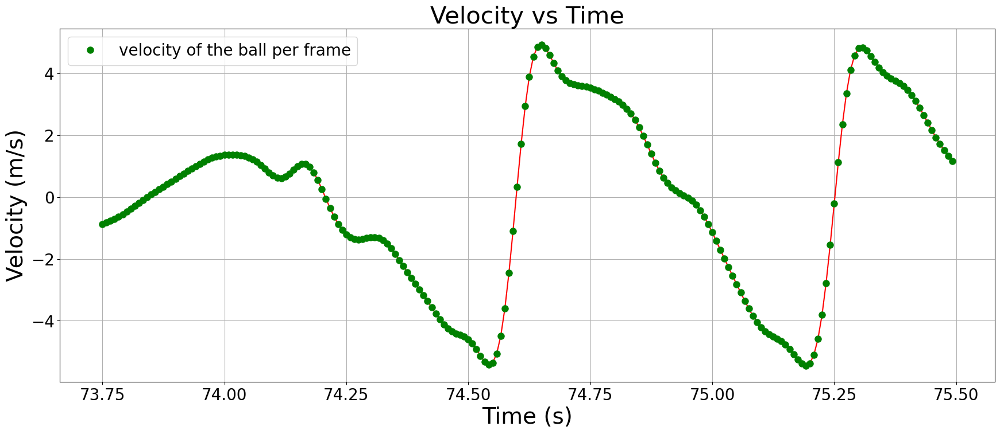
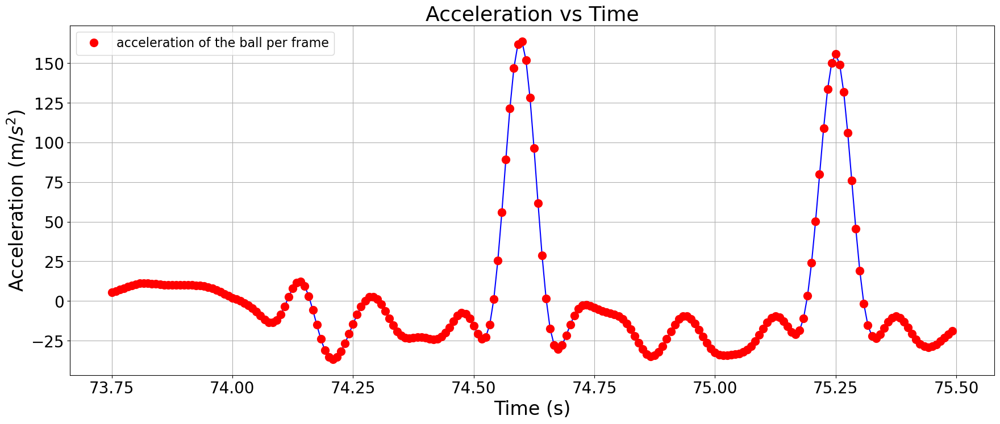
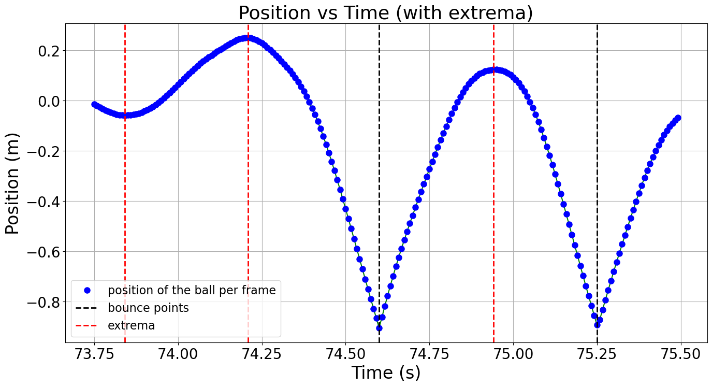
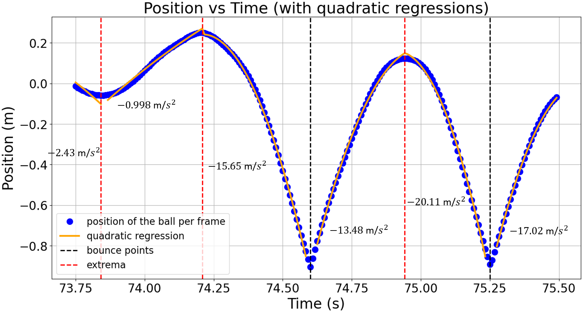

# Data Analysis

Now that the data was cleaned and ready, it was time to analyze it to extract the key metric: **average acceleration**. This would help differentiate between dribbling and carrying actions by examining how the basketball’s motion varied during different timeframes. 

The process involved **segmenting** the position vs. time data and applying **quadratic regression** to each segment. 

## Segmenting the Time Series
To calculate the average acceleration, the time-series data needed to be divided into segments. These segments were determined based on:

- **Bounce Points**: Points where the basketball contacts the ground, marked by a change of direction in velocity and a sharp spike in acceleration.
- **Local Extrema**: High or low points in the ball’s trajectory where velocity changes direction, but without the dramatic acceleration spike seen at bounces.

## Applying Quadratic Regression

Once the data was segmented, I applied quadratic regression to each segment. Why quadratic? Because the basketball's position vs. time data follows the parabolic curve described by the kinematic equation: $x = v_0t + \frac{1}{2}at^2$, where $a$ represents the basketball's acceleration. By performing quadratic regression, one of the coefficients directly corresponds to the ball's acceleration.

With this, we can assess whether the theoretical framework I proposed in this project is valid. Specifically, I hypothesized that we can determine if the action is a carry or a dribble based on the calculated acceleration: greater than -9.8 m/s² for carrying, and less than -9.8 m/s² for dribbling.

[Continue to Part 6: Data Validation](part6.md)
